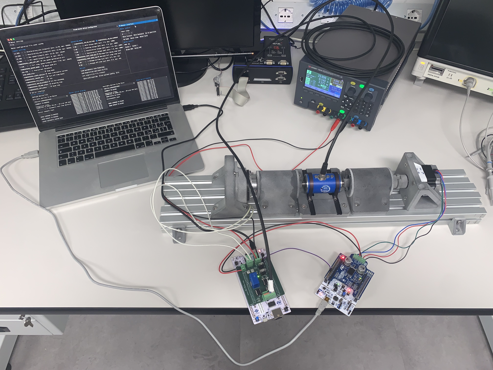
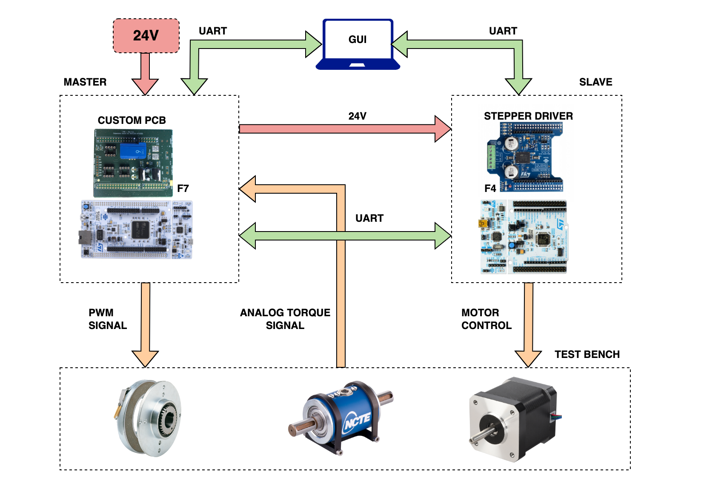
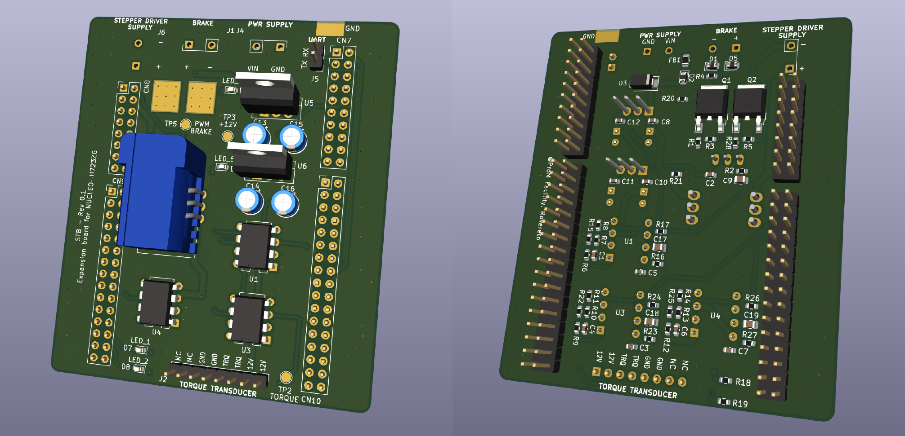
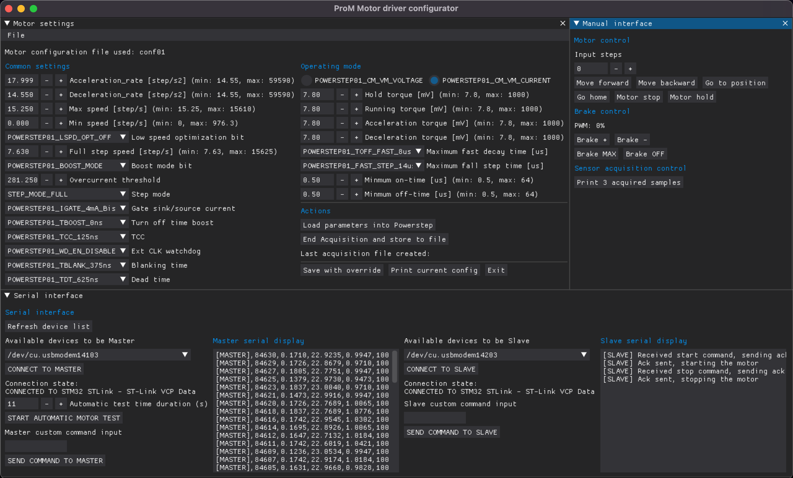
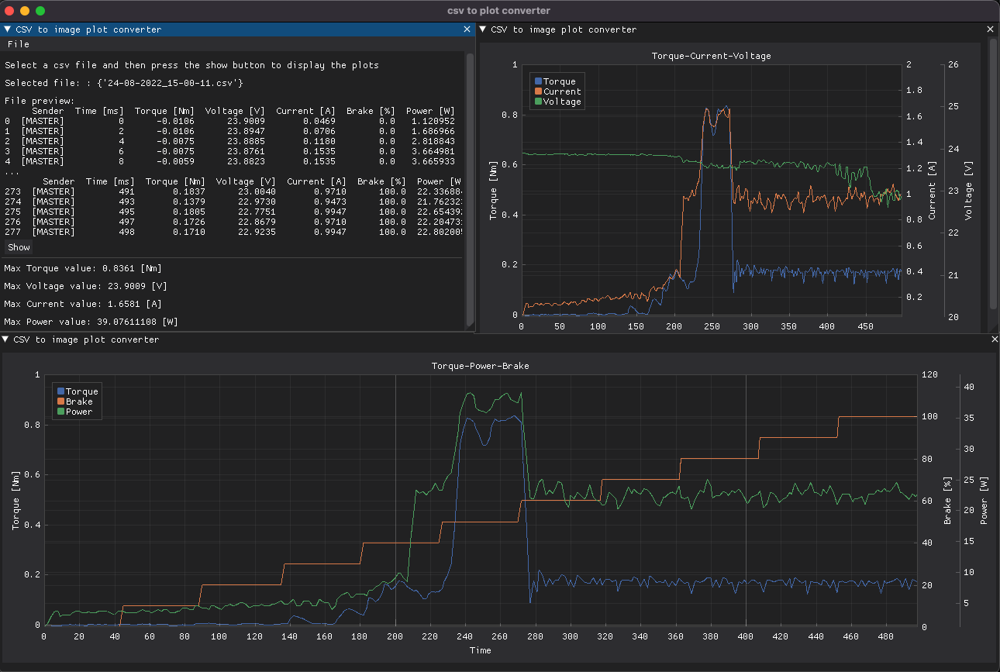

# Step-motor-test-bench

Step Motor Testbench is a tool made in collaboration with [ProM Facility](https://promfacility.eu/#/) which can be used to measure the __maximum power__ and the __maximum torque__ of a step motor.  
Notice that this is a prototype made up to validate the innovative company idea. 

## Functionalities
1. Driving the stepper motor
2. Driving the magnetic brake
3. Measuring torque, voltage and current of the motor
4. Set the motor driver parameters and show the plots related to the obtained motor curves using a GUI (Graphical User Interface)

## Main components
- Step motor (device under test)
- Torque sensor
- Magnetic brake
- Master unit made of
    - Nucleo STM32 F7 Board
    - Custom PCB for sensing and signal conditioning
- Slave unit made of
    - Nucleo STM32 F4 Board
    - STM X-NUCLEO-IHM03A1 stepper driver extension board

## System Block Diagram

## [Thesis](/Documentation/Thesis_Lisa_Santarossa.pdf) Abstract
I attended my academic internship at ProM Facility, a company specialised in creating ad-hoc mecha-
tronics applications, and here I decided to take part in solving one of their needs. Since several of their
applications involve stepper motors, ProM needed to have a stepper testbench to test these devices:
in this way, it would be possible to precisely know their behaviour in order to achieve a better final
product quality.

This thesis discusses the design and development of a **stepper motor testbench prototype** sub-
section, which includes an expansion board to acquire sensors signals and an ***Azure RTOS* driver
unit** based on an STM32 microcontroller to physically drive the motor. The system ideated was built
from scratch following ProM’s design requirements.

The expansion board represents the hardware part of the project. It is a Printed Circuit Board (PCB)
designed with Kicad, an electronic open-source CAD. After being realised, the board was analysed with
a thermographic camera to verify the power-on components’ condition state, with an oscilloscope to
test the acquired signals’ noise, and with an electromagnetic scanner to measure the electromagnetic
compatibility (EMC). On the other hand, the driver unit represents the firmware development of
the stepper driver based on *STM-Nucleo F4 series board*, it is implemented and debugged with the
environment offered by STMicroelectronics called STM32-CubeIDE.

The expansion board and the driver unit firmware work properly: they satisfy ProM’s requirements
and lay the foundations for future developments of the prototype.

## Project Structure
    ├── 📁 Documentation    -> media and thesis pdf
    ├── 📁 Firmware         -> slave and master units firmware
    ├── 📁 GUI              -> graphical user iterface and plot scripts
    └── 📁 Hardware         -> custom master unit expansion board kicad project

## Expansion Board Overview
The custom-designed PCB is a shield that can be mounted on top of the main board. It allows for the acquisition of current, voltage, and torque signals while controlling the electromagnetic brake, ensuring proper power management and protection.

## GUI Overview
The GUI is made up of two main windows: the first one is used to control the motor driver parameters, to test the motor under load, to communicate with both units using serial communication and to save the acquired data into a csv file. The second one is used to plot the acquired data into some.

The second one is used to read the sensors values and to plot the acquired data in a dynamic way. 

